# GSE266690 Xenium: preprocessing and niche analysis

Sections: 19. Cells after QC: 2,357,712 of 2,422,242 (97.3 %). Genes common to all sections: 307 (the two panel batches differ in their 100-gene custom sets).

Pipeline: `scripts/02_preprocess.py` (QC, normalisation, PCA, kNN, Leiden, marker-set annotation) → `scripts/03_niche.py` (spatial kNN graph, neighbourhood composition, k-means niches, enrichment, abundance contrasts, squidpy neighbourhood enrichment). Figures are in `results/figures/` and `results/niches/`.

## 1. QC per section

| sample_id | GSM | experiment | condition | cells raw | cells QC | % removed | median transcripts | median genes | median area µm² | neg-probe % |
|---|---|---|---|---|---|---|---|---|---|---|
| Recov_Cntl1 | GSM8253804 | recovery | Control | 118939 | 116505 | 2 | 281 | 86 | 350 | 0.41 |
| Recov_Cntl2 | GSM8253805 | recovery | Control | 111183 | 108863 | 2.1 | 263 | 81 | 341 | 0.33 |
| Recov_CupRap1 | GSM8253806 | recovery | CupRap | 127215 | 124572 | 2.1 | 250 | 79 | 285 | 0.3 |
| Recov_CupRap2 | GSM8253807 | recovery | CupRap | 120337 | 117846 | 2.1 | 237 | 77 | 269 | 0.28 |
| NoRecov_Cntl1 | GSM8647384 | no_recovery | Control | 116173 | 111766 | 3.8 | 215 | 78 | 178 | 1.55 |
| NoRecov_Cntl2 | GSM8647385 | no_recovery | Control | 116358 | 110601 | 4.9 | 205 | 75 | 175 | 1.28 |
| NoRecov_Cntl3 | GSM8647386 | no_recovery | Control | 110739 | 108106 | 2.4 | 197 | 72 | 179 | 1.01 |
| NoRecov_CupRap1 | GSM8647387 | no_recovery | CupRap | 135899 | 131456 | 3.3 | 183 | 74 | 158 | 1.67 |
| NoRecov_CupRap2 | GSM8647388 | no_recovery | CupRap | 122729 | 119988 | 2.2 | 202 | 76 | 168 | 1.34 |
| NoRecov_CupRap3 | GSM8647389 | no_recovery | CupRap | 159849 | 152539 | 4.6 | 209 | 80 | 156 | 1.79 |
| Inf_BSA1 | GSM8647390 | infusion | BSA_infused | 133619 | 130746 | 2.2 | 196 | 69 | 168 | 0.27 |
| Inf_BSA2 | GSM8647391 | infusion | BSA_infused | 123765 | 121070 | 2.2 | 195 | 69 | 169 | 0.43 |
| Inf_BSA3 | GSM8647392 | infusion | BSA_infused | 121071 | 118170 | 2.4 | 202 | 70 | 171 | 0.57 |
| Inf_BSA4 | GSM8647393 | infusion | BSA_infused | 121843 | 118088 | 3.1 | 113 | 51 | 166 | 0.32 |
| Inf_BSA5 | GSM8647394 | infusion | BSA_infused | 120877 | 118224 | 2.2 | 229 | 75 | 164 | 0.05 |
| Inf_BSA6 | GSM8647395 | infusion | BSA_infused | 125103 | 122433 | 2.1 | 232 | 76 | 164 | 0.06 |
| Inf_OSM1 | GSM8647396 | infusion | OSM_infused | 152129 | 148742 | 2.2 | 194 | 70 | 159 | 0.63 |
| Inf_OSM2 | GSM8647397 | infusion | OSM_infused | 144934 | 141728 | 2.2 | 195 | 70 | 161 | 0.78 |
| Inf_OSM3 | GSM8647398 | infusion | OSM_infused | 139480 | 136269 | 2.3 | 199 | 72 | 161 | 1.09 |

Filters: ≥20 transcripts, ≥5 genes, cell area within the 1st–99th percentile of its section. Note the ~2× difference in median cell area between the 2023 batch (recovery experiment, Xenium analysis 1.4) and the 2024 batch (1.7): segmentation differs between batches, so cross-experiment comparisons of densities or per-cell counts should stay within experiment.

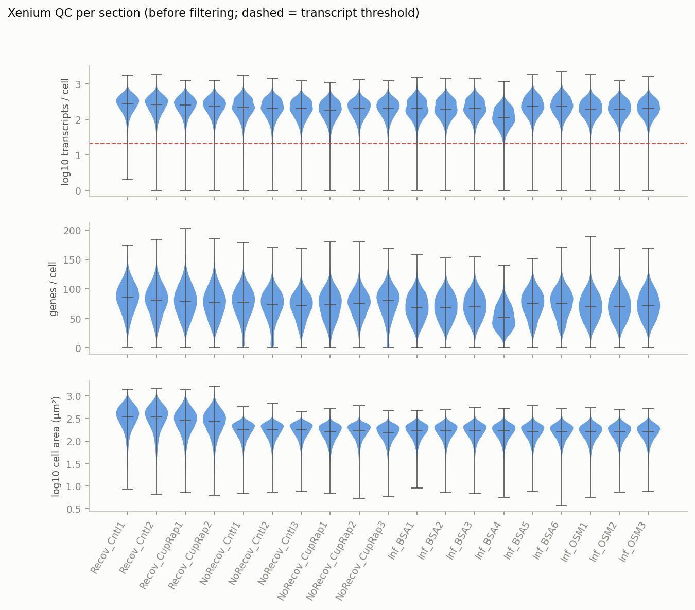

## 2. Clustering and cell-type annotation

Leiden (resolution 1.0, igraph) gave 47 clusters, annotated by marker-set scores (mean log2FC of the top-3 set genes vs all cells; pan-neuronal fallback = “Neuron (other)”). Overrides in `scripts/annotation_overrides.json`. Per-cluster scores are in `results/cluster_marker_scores.csv`; top DE genes per cluster in `results/cluster_annotation.csv`.

| cell_type | cells | % of all |
|---|---|---|
| Excitatory neuron | 633634 | 26.9 |
| Oligodendrocyte | 287750 | 12.2 |
| Striatal MSN | 258861 | 11 |
| Astrocyte | 202061 | 8.57 |
| Endothelial | 191139 | 8.11 |
| Neuron (other) | 165917 | 7.04 |
| Microglia | 158708 | 6.73 |
| Inhibitory neuron | 109188 | 4.63 |
| VLMC-Fibroblast | 106657 | 4.52 |
| OPC | 71305 | 3.02 |
| Astrocyte Gfap-high / qNSC | 37422 | 1.59 |
| Pericyte-VSMC | 35345 | 1.5 |
| Ependymal | 31150 | 1.32 |
| Neuroblast | 25726 | 1.09 |
| Lesion glia (Gfap+ Olig2+) | 22290 | 0.95 |
| Choroid plexus | 20559 | 0.87 |

Clusters concentrated in few sections (normalised sample entropy < 0.8), i.e. condition- or batch-specific states:

| leiden | cell_type | n_cells | sample_entropy_norm | top1 | top2 | top3 | top4 |
|---|---|---|---|---|---|---|---|
| 3 | Neuron (other) | 23372 | 0.74 | *Prox1* | *Bhlhe22* | *2010300C02Rik* | *Cpne6* |
| 7 | Excitatory neuron | 7921 | 0.73 | *Nwd2* | *Necab2* | *Nrp2* | *Kctd8* |
| 8 | Excitatory neuron | 54225 | 0.76 | *Slc17a6* | *Rims3* | *Nell1* | *Prox1* |
| 13 | Excitatory neuron | 11235 | 0.67 | *Neurod6* | *Cpne6* | *Arhgap12* | *Epha4* |
| 25 | Inhibitory neuron | 16614 | 0.72 | *Pvalb* | *Gad2* | *Gad1* | *Nr2f2* |
| 29 | Neuroblast | 25726 | 0.74 | *Trpc4* | *Gad1* | *Gad2* | *Cacna2d2* |
| 31 | Unassigned | 22290 | 0.5 | *Gfap* | *Olig2* | *Dpy19l1* | *Pdgfra* |
| 39 | Neuron (other) | 7741 | 0.67 | *Syt6* | *Dner* | *Gad2* | *Bcl11b* |
| 41 | Excitatory neuron | 12053 | 0.59 | *Calb2* | *Ebf3* | *Slc17a6* | *Eps8* |
| 42 | Excitatory neuron | 3485 | 0.28 | *Cpne6* | *Slc17a7* | *Hpcal1* | *Nr2f2* |

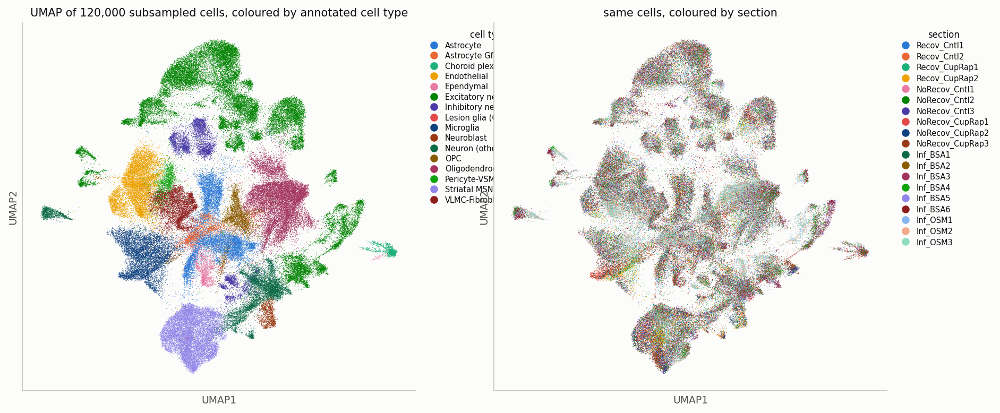
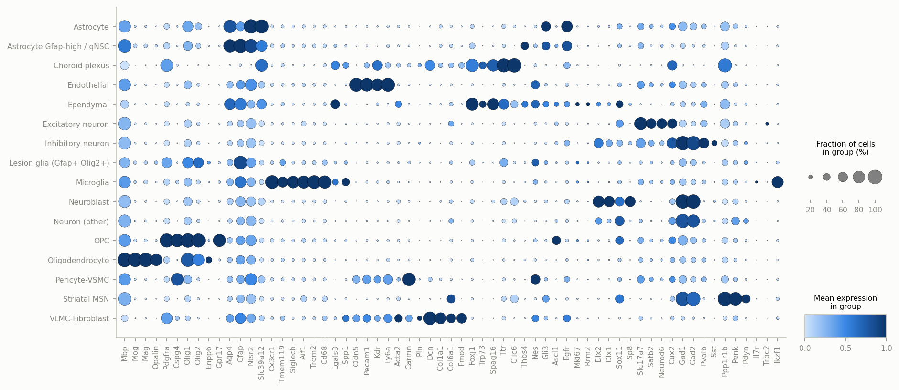
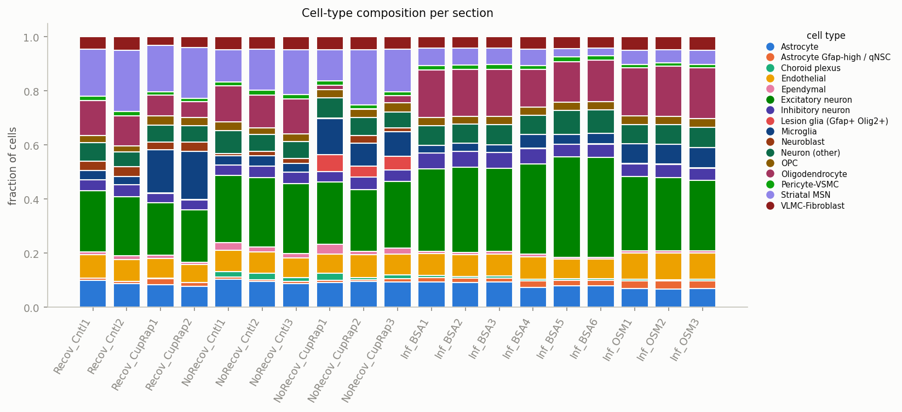
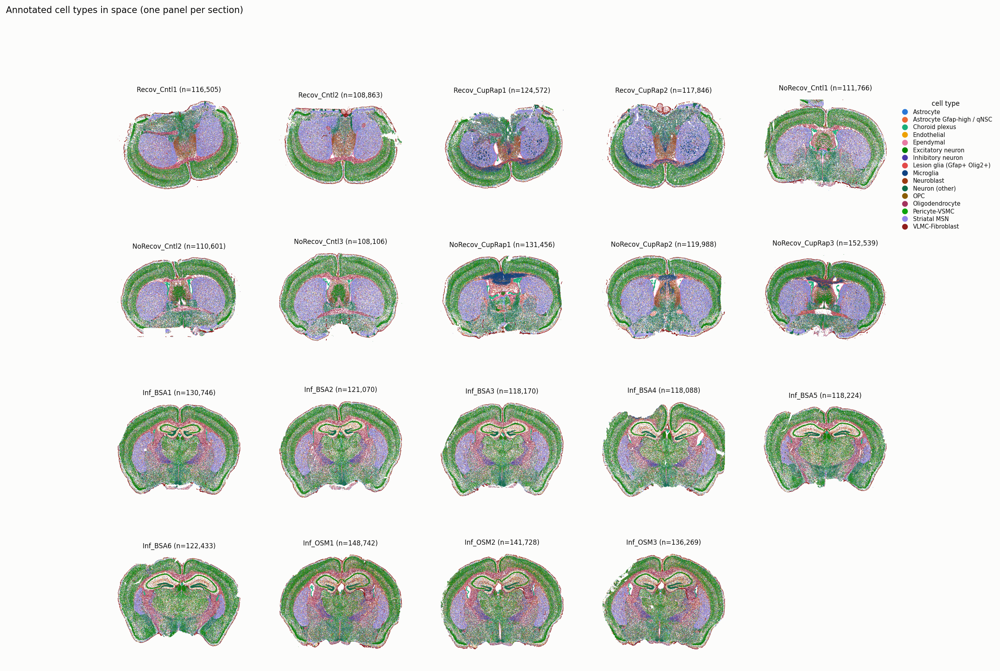

## 3. Niches (k = 6, silhouette-selected)

Neighbourhood composition = cell-type fractions among the 15 nearest neighbours within a section; MiniBatchKMeans, **k = 6**. Silhouette (30k-cell subsample) by k: k=5: 0.416, k=6: 0.417, k=7: 0.397, k=8: 0.334, k=9: 0.311, k=10: 0.320, k=11: 0.317, k=12: 0.344, k=13: 0.276, k=14: 0.315. Niches are named “dominant cell type | most enriched cell type”.

| niche | cells | dominant (fraction) | most enriched (log2) |
|---|---|---|---|
| N0: Oligodendrocyte | Choroid plexus | 582641 | Oligodendrocyte (30 %), Astrocyte (10 %), Excitatory neuron (10 %) | Choroid plexus (+2.0), Ependymal (+1.9), Neuroblast (+1.8) |
| N1: Striatal MSN | Lesion glia (Gfap+ Olig2+) | 386817 | Striatal MSN (63 %), Endothelial (8 %), Astrocyte (8 %) | Striatal MSN (+2.5), Lesion glia (Gfap+ Olig2+) (+0.2), Pericyte-VSMC (+0.0) |
| N2: Excitatory neuron | Inhibitory neuron | 950822 | Excitatory neuron (58 %), Endothelial (9 %), Astrocyte (8 %) | Excitatory neuron (+1.1), Inhibitory neuron (+0.6), Endothelial (+0.1) |
| N3: Neuron (other) | Astrocyte | 235337 | Neuron (other) (52 %), Astrocyte (12 %), Oligodendrocyte (7 %) | Neuron (other) (+2.9), Astrocyte (+0.4), Lesion glia (Gfap+ Olig2+) (+0.3) |
| N4: VLMC-Fibroblast | Astrocyte Gfap-high / qNSC | 117497 | VLMC-Fibroblast (69 %), Astrocyte (7 %), Endothelial (5 %) | VLMC-Fibroblast (+3.9), Astrocyte Gfap-high / qNSC (+0.1), Astrocyte (-0.2) |
| N5: Microglia | Lesion glia (Gfap+ Olig2+) | 84593 | Microglia (54 %), Oligodendrocyte (8 %), OPC (6 %) | Microglia (+3.0), Lesion glia (Gfap+ Olig2+) (+2.0), Astrocyte Gfap-high / qNSC (+1.8) |

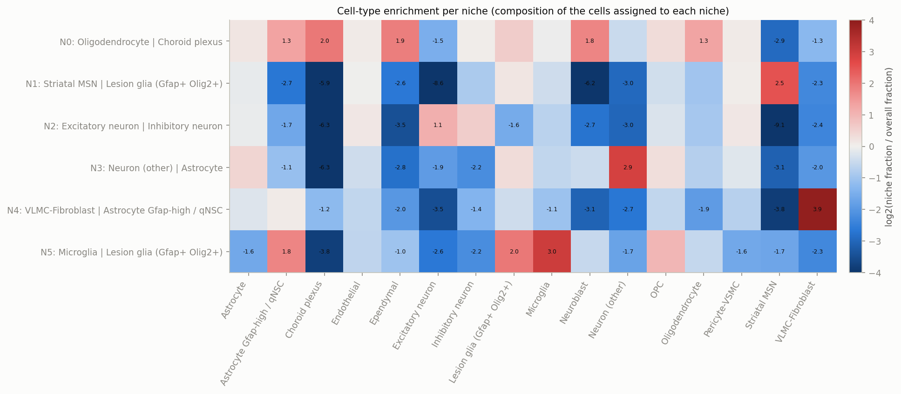
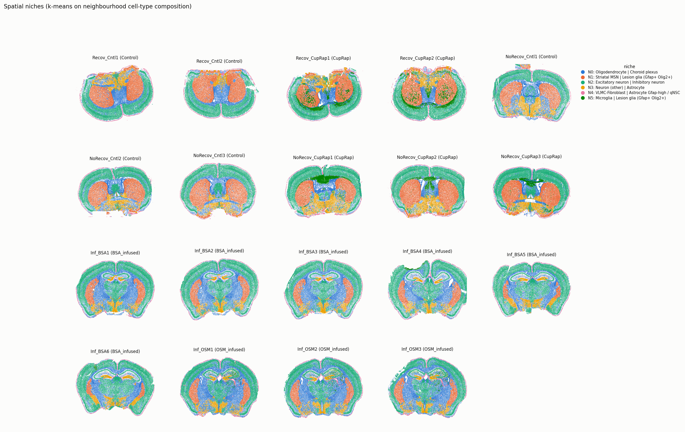

### Niche abundance by condition (k = 6)

Per-section niche fractions compared between groups within each experiment (Welch t-test and Mann–Whitney on section-level fractions; n is small, so treat p-values as descriptive). Full table: `niches/niche_differential_abundance.csv`.

**no_recovery: CupRap (n=3) vs Control (n=3)**

| niche | % CupRap | % Control | log2FC | p Welch | p MWU |
|---|---|---|---|---|---|
| N0: Oligodendrocyte | Choroid plexus | 14.3 | 23.4 | -0.703 | 0.016 | 0.081 |
| N5: Microglia | Lesion glia (Gfap+ Olig2+) | 8.59 | 0.03 | 7.86 | 0.04 | 0.081 |
| N2: Excitatory neuron | Inhibitory neuron | 36.5 | 38.5 | -0.078 | 0.287 | 0.19 |
| N3: Neuron (other) | Astrocyte | 11.3 | 10.5 | 0.107 | 0.634 | 0.663 |
| N1: Striatal MSN | Lesion glia (Gfap+ Olig2+) | 24.1 | 22.3 | 0.11 | 0.693 | 1 |
| N4: VLMC-Fibroblast | Astrocyte Gfap-high / qNSC | 5.22 | 5.32 | -0.028 | 0.781 | 1 |

**recovery: CupRap (n=2) vs Control (n=2)**

| niche | % CupRap | % Control | log2FC | p Welch | p MWU |
|---|---|---|---|---|---|
| N2: Excitatory neuron | Inhibitory neuron | 30 | 34.5 | -0.199 | 0.029 | 0.245 |
| N5: Microglia | Lesion glia (Gfap+ Olig2+) | 15.8 | 0.02 | 8.92 | 0.048 | 0.245 |
| N4: VLMC-Fibroblast | Astrocyte Gfap-high / qNSC | 3.84 | 5.4 | -0.492 | 0.16 | 0.245 |
| N0: Oligodendrocyte | Choroid plexus | 15.4 | 21.7 | -0.498 | 0.175 | 0.245 |
| N1: Striatal MSN | Lesion glia (Gfap+ Olig2+) | 25.8 | 29.6 | -0.203 | 0.445 | 0.699 |
| N3: Neuron (other) | Astrocyte | 9.18 | 8.75 | 0.069 | 0.852 | 1 |

**infusion: OSM_infused (n=3) vs BSA_infused (n=6)**

| niche | % OSM_infused | % BSA_infused | log2FC | p Welch | p MWU |
|---|---|---|---|---|---|
| N5: Microglia | Lesion glia (Gfap+ Olig2+) | 2.16 | 0.33 | 2.69 | 0 | 0.028 |
| N0: Oligodendrocyte | Choroid plexus | 36.3 | 28.2 | 0.364 | 0.001 | 0.028 |
| N2: Excitatory neuron | Inhibitory neuron | 39.1 | 49.2 | -0.332 | 0.001 | 0.028 |
| N4: VLMC-Fibroblast | Astrocyte Gfap-high / qNSC | 5.34 | 4.76 | 0.168 | 0.084 | 0.053 |
| N3: Neuron (other) | Astrocyte | 9.3 | 10.1 | -0.115 | 0.206 | 1 |
| N1: Striatal MSN | Lesion glia (Gfap+ Olig2+) | 7.8 | 7.45 | 0.067 | 0.75 | 0.519 |

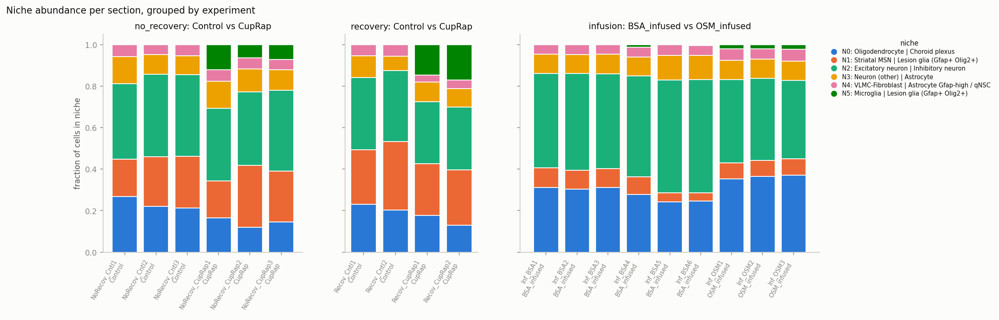
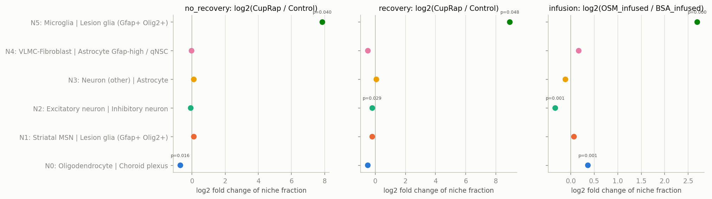

### Cell-type neighbourhood enrichment

squidpy `nhood_enrichment` z-scores computed per section (15-NN graph, 200 permutations), averaged per condition; the right column shows the difference between groups. Per-section matrices: `niches/nhood_enrichment_z_<section>.csv`.

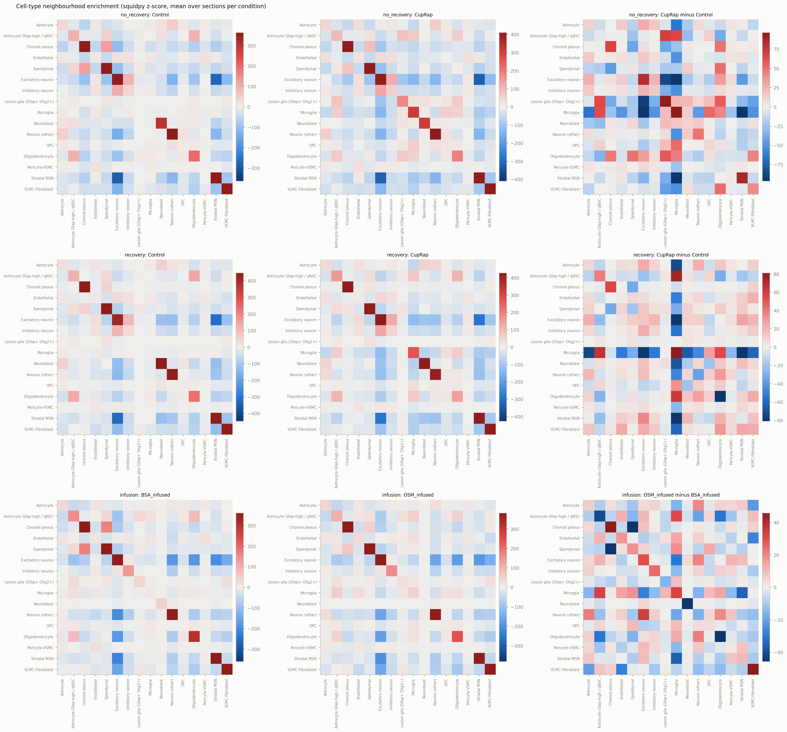

## 4. Niches (k = 12, forced)

Neighbourhood composition = cell-type fractions among the 15 nearest neighbours within a section; MiniBatchKMeans, **k = 12**. Silhouette (30k-cell subsample) by k: k=5: 0.416, k=6: 0.417, k=7: 0.397, k=8: 0.334, k=9: 0.311, k=10: 0.320, k=11: 0.317, k=12: 0.344, k=13: 0.276, k=14: 0.315. Niches are named “dominant cell type | most enriched cell type”.

| niche | cells | dominant (fraction) | most enriched (log2) |
|---|---|---|---|
| N0: Oligodendrocyte | Astrocyte Gfap-high / qNSC | 156015 | Oligodendrocyte (22 %), Inhibitory neuron (12 %), Endothelial (12 %) | Astrocyte Gfap-high / qNSC (+2.2), Lesion glia (Gfap+ Olig2+) (+2.0), Inhibitory neuron (+1.4) |
| N1: Excitatory neuron | Inhibitory neuron | 470866 | Excitatory neuron (58 %), Endothelial (9 %), Astrocyte (8 %) | Excitatory neuron (+1.1), Inhibitory neuron (+0.7), Endothelial (+0.2) |
| N2: Striatal MSN | Lesion glia (Gfap+ Olig2+) | 381467 | Striatal MSN (63 %), Endothelial (8 %), Astrocyte (8 %) | Striatal MSN (+2.5), Lesion glia (Gfap+ Olig2+) (+0.1), Pericyte-VSMC (+0.0) |
| N3: Neuron (other) | Astrocyte | 142900 | Neuron (other) (63 %), Astrocyte (10 %), Oligodendrocyte (5 %) | Neuron (other) (+3.2), Astrocyte (+0.2), OPC (+0.1) |
| N4: VLMC-Fibroblast | Astrocyte Gfap-high / qNSC | 108076 | VLMC-Fibroblast (72 %), Astrocyte (7 %), Endothelial (5 %) | VLMC-Fibroblast (+4.0), Astrocyte Gfap-high / qNSC (-0.0), Astrocyte (-0.3) |
| N5: Neuron (other) | Astrocyte | 192534 | Neuron (other) (27 %), Astrocyte (17 %), Oligodendrocyte (13 %) | Neuron (other) (+1.9), Lesion glia (Gfap+ Olig2+) (+1.1), Astrocyte (+1.0) |
| N6: Oligodendrocyte | Astrocyte Gfap-high / qNSC | 170246 | Oligodendrocyte (63 %), Astrocyte Gfap-high / qNSC (6 %), Microglia (6 %) | Oligodendrocyte (+2.4), Astrocyte Gfap-high / qNSC (+2.0), OPC (+0.3) |
| N7: Ependymal | Neuroblast | 68333 | Ependymal (39 %), Neuroblast (27 %), Astrocyte (8 %) | Ependymal (+4.9), Neuroblast (+4.6), Choroid plexus (+1.0) |
| N8: Excitatory neuron | Endothelial | 319595 | Excitatory neuron (42 %), Oligodendrocyte (12 %), Endothelial (11 %) | Excitatory neuron (+0.6), Pericyte-VSMC (+0.5), Inhibitory neuron (+0.5) |
| N9: Choroid plexus | Ependymal | 21066 | Choroid plexus (91 %), Ependymal (6 %), VLMC-Fibroblast (2 %) | Choroid plexus (+6.7), Ependymal (+2.1), VLMC-Fibroblast (-0.9) |
| N10: Excitatory neuron | Inhibitory neuron | 262660 | Excitatory neuron (70 %), Endothelial (7 %), Inhibitory neuron (6 %) | Excitatory neuron (+1.4), Inhibitory neuron (+0.3), Endothelial (-0.2) |
| N11: Microglia | Lesion glia (Gfap+ Olig2+) | 63942 | Microglia (63 %), Oligodendrocyte (8 %), OPC (6 %) | Microglia (+3.2), Astrocyte Gfap-high / qNSC (+1.5), Lesion glia (Gfap+ Olig2+) (+1.4) |

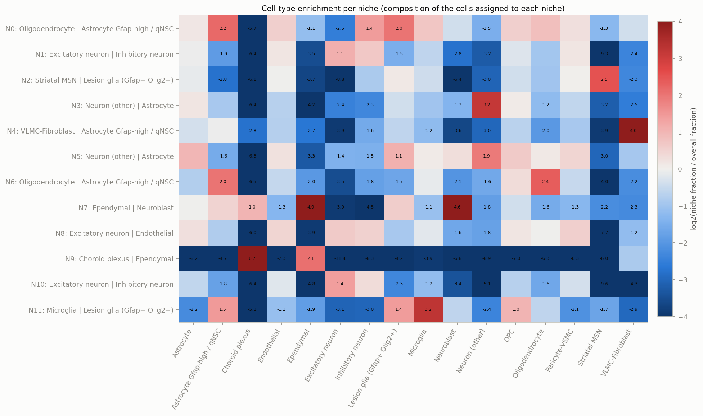
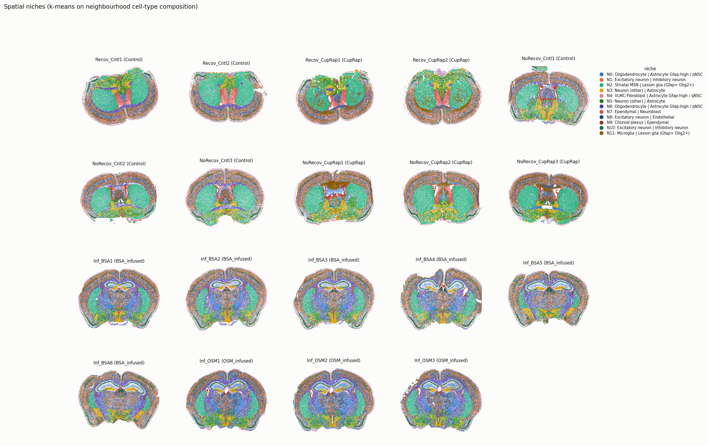

### Niche abundance by condition (k = 12)

Per-section niche fractions compared between groups within each experiment (Welch t-test and Mann–Whitney on section-level fractions; n is small, so treat p-values as descriptive). Full table: `niches_k12/niche_differential_abundance.csv`.

**no_recovery: CupRap (n=3) vs Control (n=3)**

| niche | % CupRap | % Control | log2FC | p Welch | p MWU |
|---|---|---|---|---|---|
| N6: Oligodendrocyte | Astrocyte Gfap-high / qNSC | 0.61 | 5.58 | -3.17 | 0.011 | 0.081 |
| N8: Excitatory neuron | Endothelial | 8.52 | 13 | -0.611 | 0.047 | 0.081 |
| N11: Microglia | Lesion glia (Gfap+ Olig2+) | 6.77 | 0.01 | 8.7 | 0.066 | 0.081 |
| N0: Oligodendrocyte | Astrocyte Gfap-high / qNSC | 4.64 | 3.58 | 0.373 | 0.14 | 0.19 |
| N10: Excitatory neuron | Inhibitory neuron | 10.2 | 9.21 | 0.142 | 0.309 | 0.383 |
| N7: Ependymal | Neuroblast | 4.34 | 3.85 | 0.174 | 0.335 | 0.663 |
| N1: Excitatory neuron | Inhibitory neuron | 19.5 | 20.3 | -0.058 | 0.558 | 1 |
| N4: VLMC-Fibroblast | Astrocyte Gfap-high / qNSC | 4.78 | 4.97 | -0.054 | 0.588 | 1 |
| N9: Choroid plexus | Ependymal | 1.56 | 1.89 | -0.27 | 0.64 | 1 |
| N3: Neuron (other) | Astrocyte | 6.05 | 5.68 | 0.09 | 0.68 | 1 |
| N2: Striatal MSN | Lesion glia (Gfap+ Olig2+) | 23.6 | 22 | 0.101 | 0.717 | 1 |
| N5: Neuron (other) | Astrocyte | 9.46 | 9.92 | -0.068 | 0.816 | 1 |

**recovery: CupRap (n=2) vs Control (n=2)**

| niche | % CupRap | % Control | log2FC | p Welch | p MWU |
|---|---|---|---|---|---|
| N1: Excitatory neuron | Inhibitory neuron | 16.6 | 18.2 | -0.136 | 0.019 | 0.245 |
| N6: Oligodendrocyte | Astrocyte Gfap-high / qNSC | 1.99 | 5.77 | -1.53 | 0.043 | 0.245 |
| N11: Microglia | Lesion glia (Gfap+ Olig2+) | 13.1 | 0 | 9.85 | 0.06 | 0.245 |
| N8: Excitatory neuron | Endothelial | 8.45 | 11.4 | -0.435 | 0.129 | 0.245 |
| N4: VLMC-Fibroblast | Astrocyte Gfap-high / qNSC | 3.62 | 5.14 | -0.506 | 0.155 | 0.245 |
| N10: Excitatory neuron | Inhibitory neuron | 6.98 | 8.09 | -0.213 | 0.246 | 0.245 |
| N7: Ependymal | Neuroblast | 5.13 | 6.29 | -0.294 | 0.312 | 0.245 |
| N0: Oligodendrocyte | Astrocyte Gfap-high / qNSC | 5.43 | 3.08 | 0.816 | 0.345 | 0.245 |
| N2: Striatal MSN | Lesion glia (Gfap+ Olig2+) | 25.5 | 29.3 | -0.198 | 0.455 | 0.699 |
| N9: Choroid plexus | Ependymal | 0.08 | 0.02 | 1.85 | 0.565 | 1 |
| N5: Neuron (other) | Astrocyte | 7.81 | 7.4 | 0.077 | 0.889 | 1 |
| N3: Neuron (other) | Astrocyte | 5.26 | 5.27 | -0.004 | 0.972 | 1 |

**infusion: OSM_infused (n=3) vs BSA_infused (n=6)**

| niche | % OSM_infused | % BSA_infused | log2FC | p Welch | p MWU |
|---|---|---|---|---|---|
| N0: Oligodendrocyte | Astrocyte Gfap-high / qNSC | 12.4 | 7.13 | 0.801 | 0 | 0.028 |
| N1: Excitatory neuron | Inhibitory neuron | 17.9 | 22.9 | -0.35 | 0 | 0.028 |
| N8: Excitatory neuron | Endothelial | 17.8 | 16.4 | 0.112 | 0.003 | 0.028 |
| N11: Microglia | Lesion glia (Gfap+ Olig2+) | 0.82 | 0.18 | 2.11 | 0.003 | 0.028 |
| N10: Excitatory neuron | Inhibitory neuron | 10.3 | 15.4 | -0.582 | 0.006 | 0.028 |
| N5: Neuron (other) | Astrocyte | 8.52 | 6.75 | 0.335 | 0.024 | 0.053 |
| N9: Choroid plexus | Ependymal | 0.67 | 0.73 | -0.136 | 0.068 | 0.156 |
| N6: Oligodendrocyte | Astrocyte Gfap-high / qNSC | 12.2 | 10.9 | 0.165 | 0.08 | 0.053 |
| N4: VLMC-Fibroblast | Astrocyte Gfap-high / qNSC | 4.86 | 4.3 | 0.176 | 0.091 | 0.053 |
| N3: Neuron (other) | Astrocyte | 5.73 | 6.98 | -0.284 | 0.112 | 0.156 |
| N7: Ependymal | Neuroblast | 1.1 | 0.97 | 0.183 | 0.149 | 0.156 |
| N2: Striatal MSN | Lesion glia (Gfap+ Olig2+) | 7.67 | 7.37 | 0.058 | 0.785 | 0.519 |

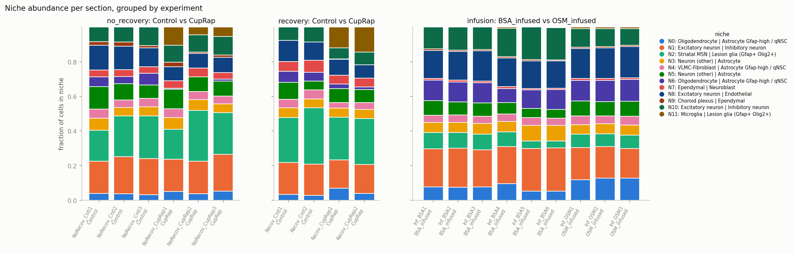
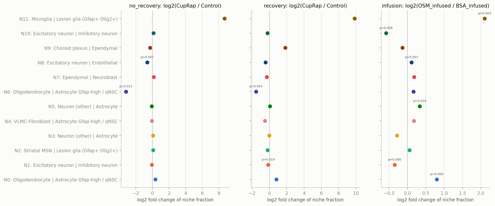

## 5. Cell-type composition by condition

### no_recovery

| index | % CupRap | % Control | log2FC |
|---|---|---|---|
| Lesion glia (Gfap+ Olig2+) | 5.06 | 0.04 | 6.54 |
| Microglia | 10.3 | 3.5 | 1.56 |
| OPC | 3.16 | 2.78 | 0.18 |
| Ependymal | 2.38 | 2.13 | 0.16 |
| Striatal MSN | 15.9 | 14.5 | 0.13 |
| Inhibitory neuron | 4.28 | 4.1 | 0.06 |
| Astrocyte Gfap-high / qNSC | 0.81 | 0.78 | 0.05 |
| Neuroblast | 1.43 | 1.4 | 0.04 |
| Endothelial | 7.77 | 7.63 | 0.03 |
| VLMC-Fibroblast | 4.7 | 4.76 | -0.02 |
| Astrocyte | 9.41 | 9.56 | -0.02 |
| Neuron (other) | 6.69 | 7 | -0.06 |
| Excitatory neuron | 23.5 | 25.4 | -0.12 |
| Pericyte-VSMC | 1.47 | 1.69 | -0.2 |
| Choroid plexus | 1.58 | 1.9 | -0.26 |
| Oligodendrocyte | 1.48 | 12.8 | -3.1 |

### recovery

| index | % CupRap | % Control | log2FC |
|---|---|---|---|
| Microglia | 16.9 | 3.25 | 2.38 |
| Choroid plexus | 0.08 | 0.02 | 1.7 |
| Lesion glia (Gfap+ Olig2+) | 0.09 | 0.02 | 1.57 |
| Astrocyte Gfap-high / qNSC | 1.73 | 0.77 | 1.15 |
| OPC | 3.18 | 2.48 | 0.36 |
| Neuron (other) | 6.22 | 6.22 | -0 |
| Striatal MSN | 18 | 19.9 | -0.15 |
| Neuroblast | 3.11 | 3.51 | -0.18 |
| Excitatory neuron | 19.4 | 22.2 | -0.19 |
| Astrocyte | 8.11 | 9.4 | -0.21 |
| Inhibitory neuron | 3.61 | 4.21 | -0.22 |
| Endothelial | 7.04 | 8.42 | -0.26 |
| Pericyte-VSMC | 1.23 | 1.6 | -0.37 |
| Ependymal | 0.92 | 1.2 | -0.39 |
| VLMC-Fibroblast | 3.56 | 4.83 | -0.44 |
| Oligodendrocyte | 6.76 | 12 | -0.82 |

### infusion

| index | % OSM_infused | % BSA_infused | log2FC |
|---|---|---|---|
| Microglia | 7.4 | 3.51 | 1.07 |
| Lesion glia (Gfap+ Olig2+) | 0.17 | 0.08 | 0.99 |
| Astrocyte Gfap-high / qNSC | 2.84 | 1.85 | 0.61 |
| Endothelial | 9.67 | 7.86 | 0.3 |
| VLMC-Fibroblast | 4.96 | 4.3 | 0.21 |
| Ependymal | 0.89 | 0.78 | 0.2 |
| Oligodendrocyte | 18.4 | 16.1 | 0.19 |
| OPC | 3.27 | 3.02 | 0.11 |
| Striatal MSN | 5.1 | 5.06 | 0.01 |
| Neuron (other) | 7.15 | 7.72 | -0.11 |
| Choroid plexus | 0.59 | 0.69 | -0.21 |
| Inhibitory neuron | 4.72 | 5.49 | -0.22 |
| Astrocyte | 6.91 | 8.5 | -0.3 |
| Excitatory neuron | 26.8 | 33.4 | -0.32 |
| Neuroblast | 0.01 | 0.01 | -0.48 |
| Pericyte-VSMC | 1.14 | 1.69 | -0.56 |
